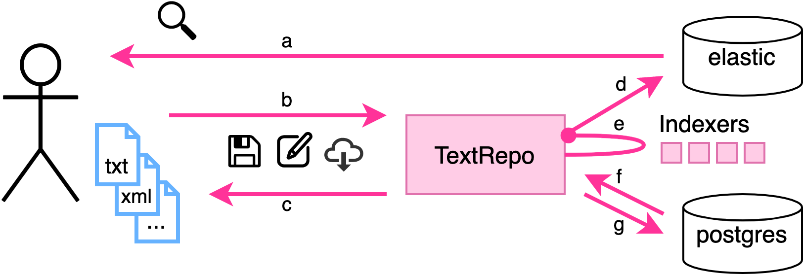

.. |tr| replace:: Text Repository

|tr|
===============

|tr| offers an API to store, version and index the texts and metadata of a corpus.

Features
--------

- Store texts of a corpus in a uniform `domain model <domain-model.html>`_:
   - Keep track of file versions
   - Link all file types to the same source document
   - Store metadata about documents, files and versions
- Use Rest API to create, read, update and delete your texts
- Search files using stock and custom `elasticsearch <https://www.elastic.co/elasticsearch/>`_ indices
- Explore API with `concordion <https://concordion.org/>`_ and `swagger <https://swagger.io/>`_

----

   Schematic overview of the |TR|: **a)** search in corpus; **b+c)** manage file types, versions and metadata of corpus; **d+e)** build custom indices that are automatically kept in sync with corpus; **f+g)** store all data in a unified database model.

Installation
------------

Prerequisites: docker-compose.

To run the |tr| locally, run in a new directory: ::

    git clone https://github.com/knaw-huc/textrepo .
    cd examples/production
    ./start-prod.sh

Read more on `basic usage <usage.html>`_

Documentation
-------------
.. toctree::
    :maxdepth: 2

    Basic Usage <usage>
    Domain model <domain-model>
    Components <components>
    Rest and Tasks API <tr-api>
    Indexing <indexing>
    Dashboard <dashboard>
    Production Setup <example-production>
    Backup Elasticsearch <example-backup-es>
    Content Coordinate System [Experimental] <experimental>

Support
-------

If you are having issues, please let us know at:

https://github.com/knaw-huc/textrepo/issues

Contribute
----------

Want to improve the |tr|? Submit a pull request at:

https://github.com/knaw-huc/textrepo

License
-------

Copyright 2020 Koninklijke Nederlandse Akademie van Wetenschappen

Licensed under the Apache License, Version 2.0 (the "License");
you may not use this file except in compliance with the License.
You may obtain a copy of the License at

    http://www.apache.org/licenses/LICENSE-2.0

Unless required by applicable law or agreed to in writing, software
distributed under the License is distributed on an "AS IS" BASIS,
WITHOUT WARRANTIES OR CONDITIONS OF ANY KIND, either express or implied.
See the License for the specific language governing permissions and
limitations under the License.
