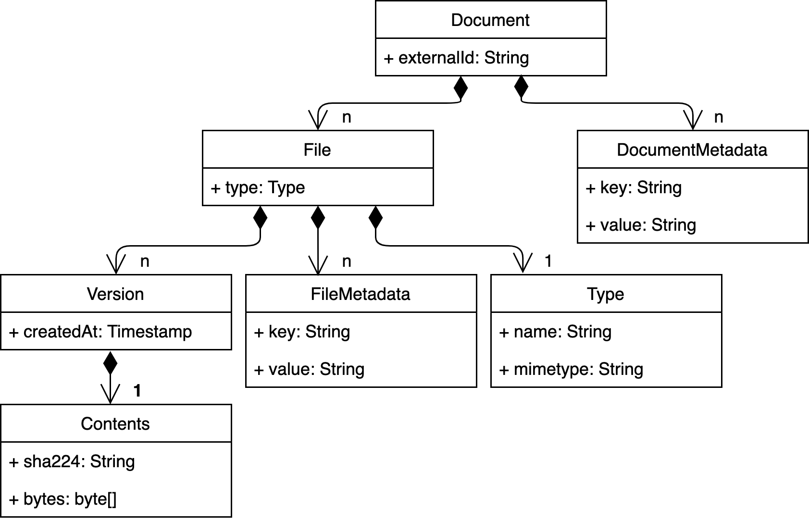

.. |tr| replace:: Text Repository

Overview
========

The |tr| was born out of the desire to archive and unlock text corpora and their various files and formats in a durable and consistent way.

Domain model
************

The |tr| is build around a number of core concepts that allow it to represent text corpora in a generic way:

- **document**: top level object which represents the core physical entity of a digitized corpus (e.g. a page) that resulted in scans, xml-files, text files and other file types. A document contains a list of files, unique by file type
- **file**: as found on your computer, including a file type but *without* its contents. A file contains a list of versions
- **version**: version of a file. A version contains the bytes of a file and a timestamp. A file can have a number of different versions
- **metadata**: both documents and files can contain metadata in the form of list of key-value pairs

----

   Graphical representation of the |tr| domain model

-----

File types
**********
The |tr| is build to contain 'human readable' file types that can be processed by elasticsearch, like plain text, json, and xml.

Work in progress
****************
Note that this project is work in progress. The |tr| model of a text corpus will improve and expand as the project progresses.
